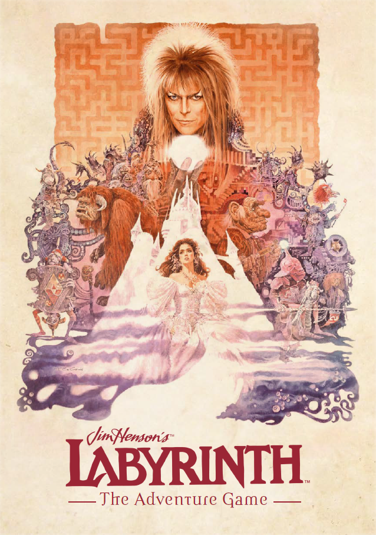

# labyrinth-simulator-kani
### **Welcome to Labyrinth!**



This is an open-sourced project for simulating the fantasy text-based adventure game: **Jim Henson's Labyrinth: The Adventure Game**[[1]](#1) grounded on large language models supported by kani[[2]](#2).

The Goblin King, which is the game manager, is built on a large language model and supports the players to proceed with the game while controlling the game flow and following the game rules.

The game system is chat-based via the terminal, where the players interact with an AI working as a game manager to explore the enormous world of the Labyrinth, including talking with the NPCs, fighting against the opponents, utilizing the objects and items, and solving the interesting puzzles!

The users can have an experience on their terminal that is almost identical to actual gameplay. Note that however, this is a research-purpose project so it cannot replace the complete in-person user experience.

For the details on the game rules of Labyrinth, you can refer to [the game book](https://www.riverhorsegames.com/products/rh_lab_005). Although this repository includes the player character data, the summarized game rules, and the metadata of each game scene, it does not cover all details and contents of the tutorial book.

<br/>

This project was carried out while working as a Research Assistant at University of Pennsylvania, under the supervision of Prof. Chris Callison-Burch.

Any feedback or opinion is welcomed. Enjoy the game!

<br/>

---

### Details

There are a few technical details of the system, which can help you understand how to set the initial arguments to run the game and what are the current limitations of the project.

- **Different rule injection methods**: You can change how the model understands or leverages the game rules during the interaction.
- **Active utilization of function calling**: The game manager not only generates a natural-language response but also calls different functions depending on the need. You might experience a more flexible and interesting game flow than just a simple chat-based interaction.
- **Different prompt designs**: You can change how an input prompt is made for each generation. You can set the concatenation policy for combining the chat history, the number of past utterances to include, and the summarization period.
- **Supporting performance evaluation**: The project supports a separate script for evaluating the model performance for each specific focus based on automated scoring by another AI evaluator. Also, you can export the whole game state and history for further human evaluation.


<br/>

---

### Arguments

**Arguments for the scene initialization**

| Argument      | Type  | Description                                                  | Default               |
| ------------- | ----- | ------------------------------------------------------------ | --------------------- |
| `--seed`      | `int` | The random seed.                                             | *YOU SHOULD SPECIFY.* |
| `--model_idx` | `str` | The index of the model.                                      | *YOU SHOULD SPECIFY.* |
| `--scene_idx` | `int` | The index of the scene to play. Note that you should specify the correct index of the scene list, which is stored in`data/scenes.json`. | *YOU SHOULD SPECIFY.* |

<br/>

**Arguments for the player creation**

| Argument        | Type  | Description                                | Default |
| --------------- | ----- | ------------------------------------------ | ------- |
| `--num_players` | `int` | The number of player characters to create. | `1`     |

<br/>

**Arguments for the gameplay**

| Argument           | Type           | Description                                                  | Default               |
| ------------------ | -------------- | ------------------------------------------------------------ | --------------------- |
| `--seed`           | `int`          | The random seed for randomized operations.                   | *YOU SHOULD SPECIFY.* |
| `--model_idx`      | `str`          | The index of the model. Since only `openai` engine is supported for leveraging the function calling feature, the model should be the one from OpenAI API. Check kani's doc (https://kani.readthedocs.io/en/latest/engine_reference.html#)[https://kani.readthedocs.io/en/latest/engine_reference.html#] to see the available models for this argument. | *YOU SHOULD SPECIFY.* |
| `--rule_injection` | `str`          | The rule injection policy. The available options include: 1) `full` - The summarized game rules are always included in the system prompt. The summarization is stored in `src/constants.py`. 2)`retrieval` - The system fetches the relevant rule segments every time the model generates a response. | `full`                |
| `--scene_path`     | `str`          | The path of the JSON file which has the initialized scene information before. | *YOU SHOULD SPECIFY.* |
| `--players_path`   | `str`          | The path of the JSON file which has the created player character information before. If the file cannot be found, the system will make you create the new characters from the beginning. | -                     |
| `--export_data`    | `'store_true'` | Setting whether to export the gameplay data after the game for the evaluation purpose. The exported result will be stored in `results` directory. | *Set by default.*     |
| `--num_ai_players` | `int`          | The number of AI players to simulate. Note that this cannot be larger than the number of players created in `--player_path`. | `0`                   |

<br/>

**Arguments for the prompt construction**

| Argument           | Type           | Description                                                  | Default  |
| ------------------ | -------------- | ------------------------------------------------------------ | -------- |
| `--concat_policy`  | `str`          | The concatenation policy for including the previous chat logs. The available options include: 1) `simple` - The manager simply concatenates the most recent turns. 2) `retrieval` - The manager retrieves the most relevant utterances from the history using sentence embedding and cosine similarity. Note that the current user inputs are always included. | `simple` |
| `--max_num_msgs`   | `int`          | The maximum number of messages to be included in the prompt as chat history. If it is not specified, the model includes as many messages as possible. Note that without this argument, the retrieval method for concatenation will work identically to the simple concatenation. | -        |
| `--summarization`  | `'store_true'` | Setting whether to include the summarization or not. The system will summarize the chat logs when a certain number of turns has reached(`--summ_period`), and add the output to the chat history. The summarized logs are also considered as the chat logs and fetched according to `--concat_policy` and `--max_turns`. | -        |
| `--summ_period`    | `int`          | The summarization period in terms of the number of turns. If a value $p$ is set for this argument, the system will summarize the last $p$ turns when the number of logs becomes a multiple of $p$. Note that if this is not specified but only `--summarization` is set, the system will ignore `--concat_policy` and `--max_turns` and summarize as many logs as possible to make a prompt only with the summarization and current queries. (This is definitely different from setting `--summ_period=1`!) | -        |
| `--clear_raw_logs` | `store_true`   | Setting whether to remove the raw chat logs after the summarization. That is, except for the turns which have not been summarized yet, the rest of the logs included are all summarized logs. | -        |

<br/>

**Arguments for the processing of additional contexts**

| Argument                  | Type         | Description                                                  | Default          |
| ------------------------- | ------------ | ------------------------------------------------------------ | ---------------- |
| `--include_functions`     | `store_true` | Setting whether to use function calls or not.                | *Set by default* |
| `--include_rules`         | `store_true` | Setting whether to include the game rules in the prompt.     | *Set by default* |
| `--include_scene_state`   | `store_true` | Setting whether to include the state of the current scene.   | *Set by default* |
| `--include_players_state` | `store_true` | Setting whether to include the states of the players.        | *Set by default* |
| `--generate_states`       | `store_true` | Setting whether to use a model to directly generate the scene/player states. | -                |

<br/>

**Arguments for the response generation**

Note that these are only used for the actual interaction during the game. Other tasks, such as initializing a scene, classification-based decisions in the functions, and summarization, will have default decoding parameters. You can refer to [the document](https://platform.openai.com/docs/api-reference/chat/create) for more details.

| Argument              | Type    | Description                                                  | Default |
| --------------------- | ------- | ------------------------------------------------------------ | ------- |
| `--max_tokens`        | `int`   | The maximum number of tokens to generate.                    | -       |
| `--frequency_penalty` | `float` | A positive value penalizes the repetitive new tokens. (-2.0 - 2.0) | `0.5`   |
| `--presence_penalty`  | `float` | A positive value penalizes the new tokens based on whether they appear in the text so far. (-2.0 - 2.0) | `0.5`   |
| `--temperature`       | `float` | A higher value makes the output more random. (0.0 - 2.0)     | `1.0`   |
| `--top_p`             | `float` | The probability mass which will be considered for the nucleus sampling. (0.0 - 1.0) | `0.8`   |

<br/>

**Arguments for the evaluation**

These are for using the separate evaluation script to test each individual model's capability on different tasks. The user can manually check the model's response and give a score for each task/question.

| Argument             | Type  | Description                                                  | Default               |
| -------------------- | ----- | ------------------------------------------------------------ | --------------------- |
| `--eval_task`        | `str` | The name of the evaluation task. The available options include: 1) `gameplay` - It performs a holistic evaluation of the exported gameplay log in terms of consistency, generation quality, or proper usage of functions. 2) `scene_init` - It validates the quality of an initialized scene compared with the original scene input. 3) `rules` - It iteratively tests the performance of a target model's understanding capability of the game rules based on Q&A form. | *YOU SHOULD SPECIFY.* |
| `--eval_model_idx`   | `str` | The index of the evaluator model. For now, since only `openai` engine is supported, the model should be the one from OpenAI API. Check kani's doc (https://kani.readthedocs.io/en/latest/engine_reference.html#)[https://kani.readthedocs.io/en/latest/engine_reference.html#] to see the available models for this argument. | *YOU SHOULD SPECIFY.* |
| `--gameplay_path`    | `str` | The path of the JSON file which stores the whole gameplay data. This is required if `--eval_task=gameplay` has been set. | -                     |
| `--scene_path`       | `str` | The path of the JSON file which has the initialized scene information before. This is required if `--eval_task=scene_init` has been set. | -                     |
| `--seed`             | `int` | The random seed for shuffling the question list. This is used when `--eval_task=rules`, but not required, since the default value will be set. | `0`                   |
| `--target_model_idx` | `str` | The index of the target model. This is required if `--eval_task=rules` has been set. Just as `--eval_model_idx`, only OpenAI's model is supported for now. | -                     |
| `--rule_injection`   | `str` | The rule injection policy. The available options include: 1) `None` - We don't inject any rule. This tests the default knowledge in the pre-trained model. 2) `full` - The summarized game rules are always included in the system prompt. The summarization is stored in `src/constants.py`. 3)`retrieval` - The system fetches the relevant rule segments every time the model generates a response. Note that for the evaluation `init`, the model always uses `full` injection no matter which value is set for this argument. | -                     |

<br/>

---

### How to run

1. In your virtual environment, install the required packages.

   ```shell
   pip install -r requirements.txt
   ```

   <br/>

2. First, you should initialize the scene you want to play. Set the arguments in `exec_init_scene.sh` to run the initialization.

   <br/>

3. Run `exec_init_scene.sh`. After initialization, the scene will be stored at: `scenes/scene={SCENE_IDX}/{USERNAME}-model={MODEL_IDX}-time={EXECUTION_TIME}.json`.

   ```shell
   sh exec_init_scene.sh
   ```

   <br/>

4. Second, you should create the player characters which can work as human players or AI teammates. Set the arguments in `exec_create_players.sh` to run the creation.

   <br/>

5. Run `exec_create_players.sh`. After initialization, the player characters will be stored at: `players/{USERNAME}-num_players={NUM_PLAYERS}-time={EXECUTION_TIME}.json`.

   ```shell
   sh exec_create_players.sh
   ```

   <br/>

6. Then modify the arguments in `exec_main.sh` to run a game scene with your preferences. Make sure to set `--scene_path` with your initialized scene generated in the previous step.

   <br/>

7. Enjoy the game! After finishing the scene or terminated by any reason, the gameplay log will be stored at: `results/scene={SCENE_IDX}/rule={RULE_INJECTION}/concat={CONCAT_POLICY}/msg_limit={MAX_NUM_MSGS}/summarization={SUMMARIZATION}/summ_period={SUMM_PERIOD}/clear_raw={CLEAR_RAW_logs}/function={INCLUDE_FUNCTIONS}/{USERNAME}-model={MODEL_IDX}-seed={SEED}-time={EXECUTION_TIME}.json`.

   ```shell
   sh exec_main.sh
   ```

<br/>

For running the evaluation script, run the command below after modifying the arguments in `exec_evaluate.sh`.

```shell
sh exec_evaluate.sh
```

<br/>

---

### Limitations & Future improvements

- **Per-scene execution**: The system is run on scene-by-scene. Currently, this project does not support the whole game. In other words, while the user can run each scene for simulation, but the state or result from the completion of a scene is not stored and not connected to the next scene execution.
- **Local multi-player gameplay**: While the system has been implemented considering the multi-player participation, the project does not support remote gameplay. That means the users should play the game on one machine.

<br/>

---

<a id="1">[1]</a> Milton, B., Cæsar, J., Froud, B., & Henson, J. (2019). *Jim Henson’s labyrinth: The adventure game*. River Horse.

<a id="2">[2]</a> Zhu, Andrew, et al. "Kani: A Lightweight and Highly Hackable Framework for Building Language Model Applications." *arXiv preprint arXiv:2309.05542* (2023).
